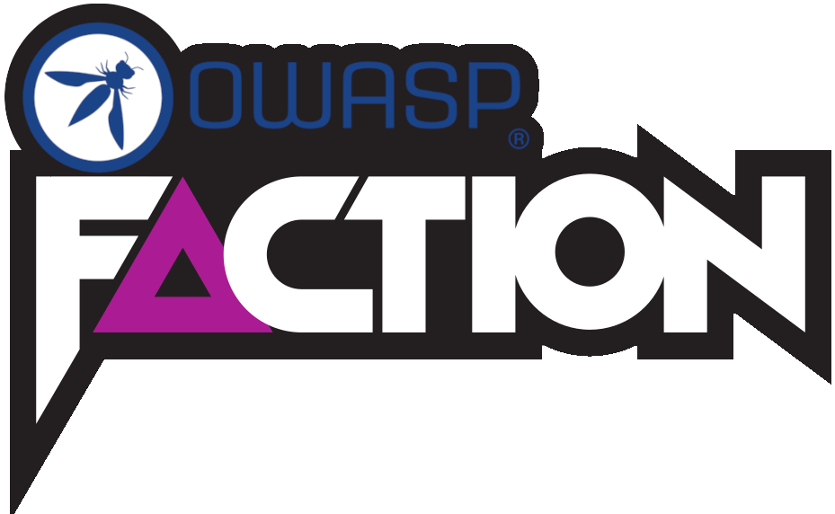

# OWASP Faction 2.0



Penetration test management for teams that produce reports for a living:
assessments, findings, peer review, retests, remediation tracking, and the
report at the end of it.

Thanks to everyone who came to our talk at BlackHat 2026. You can join the
mailing list at https://www.factionsecurity.com/signup.

## What's here

- **Assessments** — scheduling, checklists, surveys, notebooks, campaigns, and
  a calendar view of who is testing what
- **Findings** — CVSS scoring, a reusable default-vulnerability library, OWASP
  Top 10 categories, exceptions, comments, and evidence attachments
- **Peer review** — a review queue with tracked changes and diffs, so a finding
  is checked before it reaches a client
- **Retests** — scheduling, activity logs, and per-stage remediation tracking
- **Reporting** — DOCX templates through a visual designer, rendered to DOCX
  and PDF
- **AI assistance** — bring your own provider (OpenAI, Anthropic, Azure OpenAI,
  OpenRouter, or any OpenAI-compatible endpoint), with PII anonymisation before
  anything leaves your network
- **Extensions** — a JAR-based App Store SDK for hooking your own code into
  vulnerability, report and assessment events
- **Dashboards** — role-specific views for pentesters, managers, and
  remediation owners
- **Notifications** — in-app and email, with per-user preferences and
  unsubscribe

Self-hosted, Apache-2.0, and yours to modify.


## Generate Professional Reports Using Your Existing DOCX Templates


## Use AI to Update Summaries, Vulnerabilities, and any Text input 


## Craft Your Own Custom AI Prompts So Reports Match Your Voice and Style of Reporting


## Application Inventory and Application Security Posture Management


## Email Alerts and Notifications when Vulnerabilties are Approaching SLAs


## Manage Exceptions, Communications, and Retests All In One Place:


## Scope of this edition

This repository is complete as it stands: it builds, tests and runs on its own,
with no dependency on anything unpublished.

Some capabilities are not part of it — single sign-on, white-labelling, inbound
email threading, prompt-level AI audit logging, encrypted PDFs, an external owner
portal, and custom roles beyond the built-in Super Admin and Pentester. It also
applies limits of 1 AI provider, 4 AI prompts, and 2 installed integrations.

Users are not capped — run it for as many people as you have.

Those appear in the interface marked with a ◆ rather than hidden, so a feature
you cannot find is explained rather than mysterious. The boundary is visible in
the code too — `EditionPolicy`, `@RequiresFeature`, and a handful of interfaces
with open source implementations. CONTRIBUTING.md explains how to work with it,
and patches to any of it are welcome.

## Supporting the project

<!-- TODO: sponsor URL -->
If this is useful to you, sponsoring the project funds its development.
Sponsorship supports the work; it does not unlock anything, and every feature in
this repository is available to everyone on the same terms.

Faction Security separately offers a commercial edition built on this codebase,
which is where the capabilities listed above live.

## Getting Started

### Prerequisites

- **Java 25** — the backend targets it; anything older will not compile
- **Node.js 20+**
- **Maven 3.9+**
- **Docker** — the database, object storage and PII analyser all run as containers
- [**mise**](https://mise.jdx.dev/) — optional, but it pins the Java and Node
  versions for you and is how the commands below are run

### Quick start

```bash
mise run up
```

That starts the containers, the backend on `http://localhost:8080`, and the
frontend on `http://localhost:3000`. Sign in with the default credentials below.

First run takes a few minutes: Maven downloads its dependencies and Docker pulls
the images.

### The rest of the tasks

```bash
mise tasks              # everything available

mise run backend-up     # backend only (starts the database first)
mise run frontend-up    # frontend only
mise run backend-test   # backend suite — needs Docker, uses Testcontainers
mise run frontend-test  # Playwright end-to-end tests
mise run database-up    # containers only
mise run database-down  # stop them
```

### Without mise

```bash
cd backend && docker compose up -d      # TimescaleDB, MinIO, Presidio
cd backend && mvn spring-boot:run       # http://localhost:8080

cd frontend && npm install
cd frontend && npm run dev              # http://localhost:3000
```

Report generation additionally needs LibreOffice on the host, running headless
so the backend can drive it — `backend/localdev.sh` starts it and the backend
together. Everything else works without it.

## Default Credentials

For testing purposes, use these credentials:

### Admin User
- Username: `admin`
- Password: `admin123`
- Role: SuperAdmin
- Permissions: `super_admin`

### Pentester User
- Username: `pentest`
- Password: `pentest123`
- Role: Pentester
- Permissions: 19 specific pentesting-related permissions

## API Documentation

Once the backend is running, access:
- **Swagger UI**: http://localhost:8080/swagger-ui/index.html
- **OpenAPI JSON**: http://localhost:8080/v3/api-docs

## Testing

### Frontend E2E Tests (Playwright)

Run all tests:
```bash
cd frontend
npm test
```

Or with mise:
```bash
mise run frontend-test
```

Run specific test suites:
```bash
npm run test:auth      # Authentication tests
npm run test:users     # User management tests
npm run test:assessments # Assessment tests
```

View test reports:
```bash
npm run test:report
```

### Backend Unit Tests

Run all backend tests:
```bash
cd backend
mvn test
```

Or with mise:
```bash
mise run backend-test
```

## Project Structure

### Frontend
```
frontend/
├── src/
│   ├── components/          # Reusable UI components
│   │   ├── Badge.tsx        # Status badges
│   │   ├── Button.tsx       # Standard buttons
│   │   ├── Modal.tsx        # Dialog modals
│   │   └── DataTable.tsx    # Data tables with pagination
│   ├── pages/               # Page components
│   │   ├── Dashboard.tsx    # Main dashboard
│   │   ├── Users.tsx        # User management
│   │   ├── Assessments.tsx  # Assessment tracking
│   │   └── ReportDesigner.tsx # Report template designer
│   ├── api.ts               # API service layer
│   ├── types.ts             # TypeScript interfaces
│   ├── utils/               # Utility functions
│   │   └── permissions.ts   # Permission checking logic
│   ├── App.tsx              # Main app component with routing
│   └── main.tsx             # Application entry point
├── tests/                   # Playwright E2E tests
│   ├── auth.spec.ts         # Authentication tests
│   └── users.spec.ts        # User management tests
├── README.md                # Frontend-specific documentation
└── package.json
```

### Backend
```
backend/
├── src/main/java/com/faction/clientportal/
│   ├── config/              # Spring configuration
│   ├── model/               # Domain models (User, Role, Organization)
│   ├── repository/          # Spring Data JPA repositories
│   ├── service/             # Business logic services
│   │   ├── AuthService.java     # Authentication service
│   │   ├── UserService.java     # User management service
│   │   └── AssessmentService.java # Assessment service
│   ├── controller/          # REST endpoints
│   │   ├── UserController.java      # User API endpoints
│   │   ├── AssessmentController.java # Assessment API endpoints
│   │   └── ReportTemplateController.java # Report template endpoints
│   ├── dto/                 # Data Transfer Objects
│   │   ├── UserDto.java           # User data model
│   │   ├── AssessmentDto.java     # Assessment data model
│   │   └── ReportTemplateDto.java # Report template data model
│   ├── security/            # Security components
│   │   ├── JwtTokenProvider.java  # JWT token generation/validation
│   │   └── JwtAuthenticationFilter.java # Authentication filter
│   └── exception/           # Exception handling
│       └── GlobalExceptionHandler.java
├── Dockerfile               # Containerization configuration
├── pom.xml                  # Maven build configuration
└── CLAUDE.md                # Development guidelines for Claude AI
```

## Permission System

The application implements a fine-grained permission system using the pattern: `resource:action:scope`

### Common Permission Patterns
- `organizations:read:*` - Read all organizations
- `organizations:read:team` - Read team organizations only
- `assessments:create:all` - Create assessments for any organization
- `assessments:create:team` - Create assessments for own team
- `users:read:all` - View all users
- `users:read:team` - View team members
- `super_admin` - Full access to everything

### Permission-Based UI
- Navigation menus are filtered based on user permissions
- Buttons and actions are conditionally rendered
- Routes are protected with authorization checks
- Backend enforces the same permission rules for API endpoints

## Design System

The frontend follows a consistent design system:

### Color Palette (CSS Variables)
- `--primary-bg`: #0a0e1a (Dark background)
- `--secondary-bg`: #111827 (Secondary background)
- `--primary-color`: #3b82f6 (Primary brand blue)
- `--accent-color`: #8b5cf6 (Accent purple)
- `--success-color`: #10b981 (Green for success)
- `--danger-color`: #ef4444 (Red for errors)
- `--warning-color`: #f59e0b (Yellow for warnings)

### Component Library
- **Modal**: Standard dialog with header, body, and footer
- **Button**: Primary, secondary, danger, warning variants
- **Badge**: Status indicators with color coding
- **DataTable**: Paginated tables with search and filtering
- **Form Controls**: Consistent input fields with validation

## Development Workflow

### Using mise (recommended)

Run everything from the project root:
```bash
mise run up                     # Start both backend and frontend
mise run backend-up             # Backend only
mise run frontend-up            # Frontend only
mise run test-all               # Run all tests (backend + frontend)
mise run backend-build          # Build backend
mise run frontend-build         # Build frontend
```

### Frontend
1. Run `mise run frontend-up` or `npm run dev` for the development server
2. Changes are hot-reloaded in browser
3. Use TypeScript interfaces to ensure type safety
4. Write tests in Playwright for E2E coverage
5. Build with `mise run frontend-build` or `npm run build` for production

### Backend
1. Start the containers: `docker compose up -d` (in `backend/`)
2. Run application: `mise run backend-up` or `mvn spring-boot:run`
3. Use Swagger UI to test API endpoints
4. Write unit tests with JUnit and Testcontainers
5. Build with `mise run backend-build` or `mvn clean install`

## Deployment

### Docker Compose
The project includes a complete docker-compose setup:

```bash
cd backend
docker compose up -d  # TimescaleDB, MinIO, Presidio
```

For testing environment:
```bash
cd /home/nullop/Code/Faction Projects/claude-version
docker compose -f docker-compose.test.yml build
./run-ui-tests.sh     # Run end-to-end tests
```

### Production Deployment
1. Build frontend: `mise run frontend-build` or `npm run build` (creates dist/ directory)
2. Build backend JAR: `mise run backend-build` or `mvn clean package`
3. Deploy frontend to static hosting (Netlify, Vercel, S3)
4. Deploy backend as a Spring Boot application
5. Configure reverse proxy (Nginx) for SSL termination
6. Set environment variables for production configuration

## Troubleshooting

### Frontend Issues
- **Cannot connect to backend**: Ensure backend is running on `http://localhost:8080`
- **Port 3000 in use**: Change port in `vite.config.ts`
- **Styles not loading**: Clear browser cache and restart dev server

### Backend Issues
- **Database connection errors**: check the TimescaleDB container is up with `docker compose ps` (in `backend/`)
- **Maven build failures**: the backend targets Java 25 — check `java -version`, or let `mise` supply it
- **JWT authentication issues**: Verify token generation and validation logic
## Contributing

See [CONTRIBUTING.md](CONTRIBUTING.md). Commits need a DCO sign-off
(`git commit -s`); there is no CLA. Security issues go through
[SECURITY.md](SECURITY.md), not the public tracker.

## License

Apache License 2.0 — see [LICENSE](LICENSE) and [NOTICE](NOTICE).
